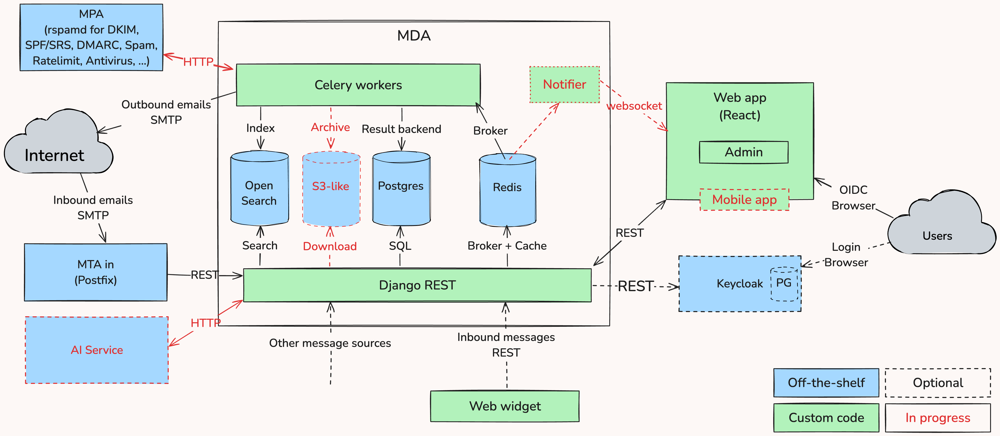

# Architecture

## System Architecture Overview

## Core Components

### Frontend App

- **Next.js Application**: React-based SPA with TypeScript
- **Auto-generated API Client**: Generated from OpenAPI schema using Orval
- **Multi-panel Interface**: Mailbox panel, thread list, and message view
- **Real-time Updates**: Using TanStack Query for efficient state management

### Backend Services

- **Django REST Framework**: Main API service handling business logic, including email processing
- **Celery Workers**: Asynchronous task processing for heavy operations
- **Search Service**: OpenSearch integration for full-text search

### Mail Transfer Layer

- **MTA-In (Inbound)**: Postfix server with Python-based recipient validation
- **MTA-Out (Outbound)**: Postfix server for email delivery and relay
- **Mail Processing Agent**: rspamd for spam filtering and mail processing

### Data Storage

- **PostgreSQL**: Primary relational database for all structured data
- **Redis**: Caching layer and Celery message broker
- **OpenSearch**: Full-text search index for messages and threads
- **S3-Compatible Storage**: File and attachment storage (In progress)

### Authentication & Authorization

- **Keycloak**: OIDC provider for user authentication
- **Role-based Access**: Multi-tenant access control via mailbox and thread permissions

## Data Flow

### Inbound Email Processing

1. External email arrives at **MTA-In** via SMTP
2. **MTA-In** validates recipients against Django backend
3. **MDA** parses and stores messages in PostgreSQL
4. **Celery** tasks index content in OpenSearch
5. Users see new messages in real-time via frontend

### Outbound Email Processing

1. User composes message in frontend
2. Frontend sends draft via REST API
3. Backend validates and queues message
4. **Celery** processes sending via **MTA-Out**
5. **MTA-Out** delivers email externally or to MailCatcher (dev)

### Search Operations

1. User submits search query via frontend
2. Backend directly queries OpenSearch for real-time results
3. Results are ranked and filtered by permissions
4. Frontend displays paginated results

### Search Indexing

1. New messages/threads are saved to PostgreSQL
2. Backend queues indexing tasks to Celery
3. Celery workers asynchronously index content in OpenSearch
4. Heavy operations (bulk imports, reindexing) are handled via Celery

## Key Features

### Multi-tenancy

- **Domain-based**: Mail domains with administrative roles
- **Mailbox-based**: Individual mailbox access permissions
- **Thread-based**: Granular access control for conversations

### Scalability

- **Microservices Architecture**: Independent scaling of components
- **Async Processing**: Non-blocking operations via Celery
- **Caching Strategy**: Redis for session and query caching
- **Search Optimization**: OpenSearch for fast full-text search

### Development Experience

- **OpenAPI-First**: Auto-generated client from backend schema
- **Docker Compose**: Complete development environment
- **Hot Reloading**: Frontend and backend development servers
- **Testing Tools**: Comprehensive test suites and monitoring

## Security Considerations

### Authentication

- OIDC integration with Keycloak
- JWT token validation
- Session management via Redis

### Authorization

- Role-based access control (RBAC)
- Resource-level permissions
- Multi-tenant isolation

### Email Security

- DKIM signing for outbound messages
- SPF and DMARC policy enforcement
- Anti-spam filtering via rspamd

### Data Protection

- Encrypted storage for sensitive data
- Secure file upload handling
- CORS and CSRF protection

## Deployment Architecture

The system is designed for containerized deployment with:

- **Docker containers** for all services
- **Environment-specific configurations** (dev, staging, production)
- **Horizontal scaling** capability for backend and Celery workers
- **Load balancing** support via nginx reverse proxy
- **Health checks** and monitoring integration (In Progress)
